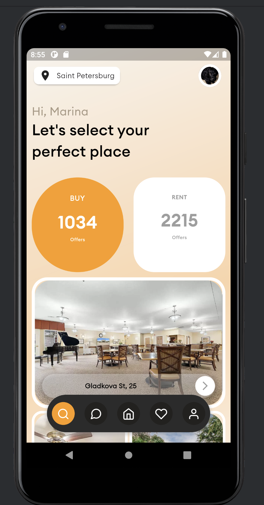
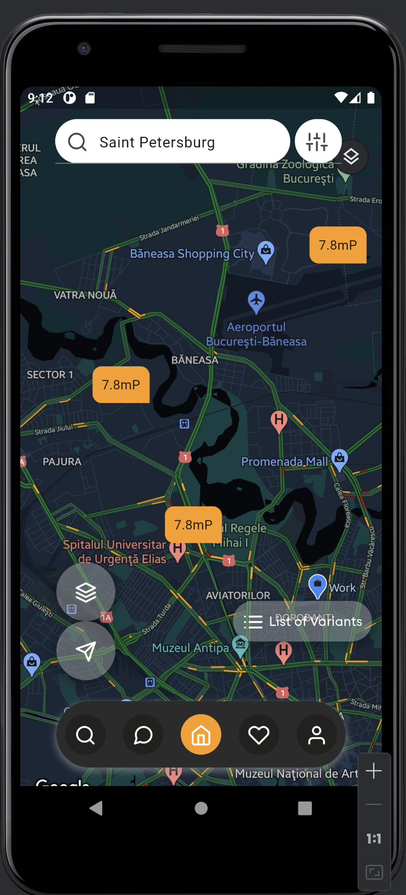

# Real Estate App

## Description

This project is a mobile application that implements the design from a Dribbble design project for a Real Estate App. The goal is to accurately translate the design into a functional Flutter application, including scroll behaviors, effects, and animations.

## Screenshots

|  |  |
| ---------------------------------------------- | ---------------------------------------------- |
| Screenshot 1                                   | Screenshot 2                                   |

## Video Demo

- Video Demo: [Real Estate App Demo](https://screenapp.io/app/#/shared/e538972c-1016-4e9a-ad7a-eb057b46a691)

## Download App

- Download Link: [App Uploaded to google drive](https://drive.google.com/file/d/1DrETZcWQrYf50EiV3gPyQUPteBw3bgy3/view?usp=sharing
  )

## Features

- Home Page
- Property Details Page (Not available)
- Search Functionality (Not available)
- Interactive Map View
- User Profile Management (Not available)

## Technologies Used

- Flutter
- Dart

## How to Run

1. Clone the repository to your local machine.
2. Install Flutter SDK and set up your development environment.
3. Open the project in your preferred IDE (e.g., Visual Studio Code).
4. Run `flutter pub get` to install dependencies.
5. Run `flutter run` to launch the app on your device or simulator.

## Credits

- Design Inspiration: [Dribbble Real Estate App](https://dribbble.com/shots/23780608-Real-Estate-App)

## License

This project is licensed under the [MIT License](https://opensource.org/licenses/MIT).
